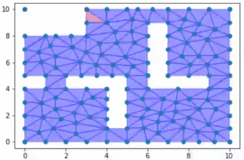

# DD2415 Safe Robot Planning and Control
Repository for assignments of the course [DD2415 Safe Robot Planning and Control](https://www.kth.se/student/kurser/kurs/DD2415) in the winter semester 2022/2023 at KTH Stockholm.
The course and the assignments cover robot control, motion planning, decision making, and task planning, especially with focus on robot safety and performance guarantees (e.g., reachability analysis and temporal logics).

## Assignment 1
Using reachibility analysis, an LQR controller, and a control barrier function to generate collision-free and safe trajectories.  

  

## Assignment 2
Using optimization-based motion planning in dynamic environments and feedback motion primitives to achieve robust trajectories.  

  

## Assignment 3
Using Linear Temporal Logic (LTL) specifications and discrete models (transition model, Büchi Automaton, product automaton) for high-level task planning.  

  
